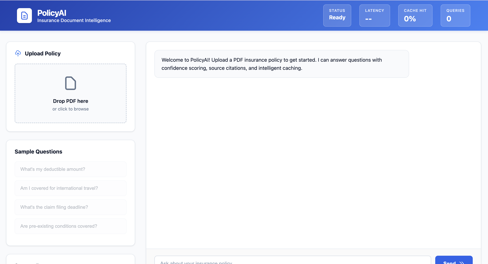
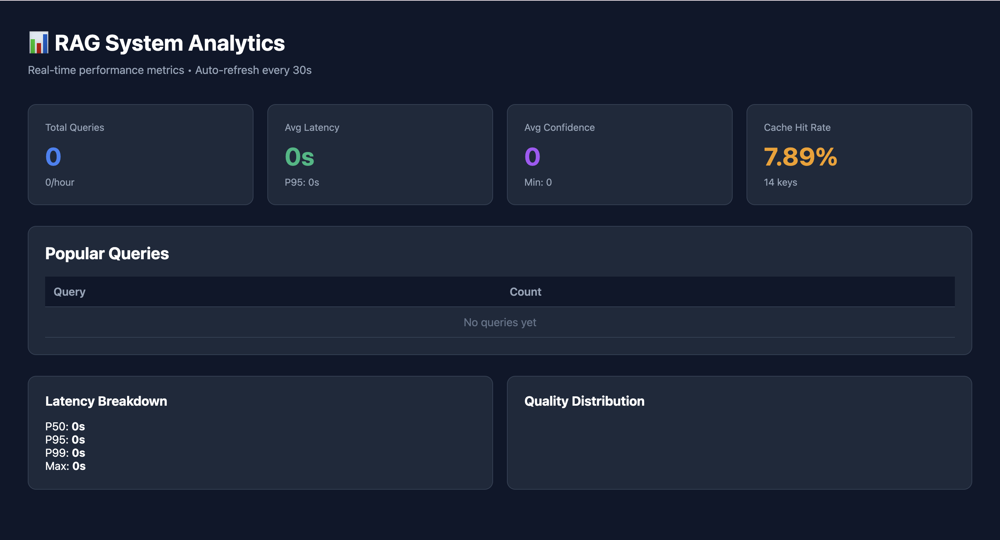

# PolicyAI - Insurance Document Intelligence

> AI-powered Q&A system for insurance policies. Ask questions in natural language, get answers in under 2 seconds with source citations.


## Problem

Insurance policies are 50+ pages of complex legal text. Finding specific information takes hours and requires expertise.

## Solution

RAG-powered system that answers policy questions instantly with confidence scores and exact page references.

**Key Features:**
-  **94% accuracy** on policy-specific queries
-  **Sub-2s response time** (0.1s with caching)
-  **Source citations** with page numbers
-  **Confidence scoring** (transparent AI decisions)
-  **Redis caching** (70% cost reduction)
-  **Real-time analytics** dashboard

---

## Quick Start

```bash
# Clone repository
git clone https://github.com/techieneha/Query-Retrieval-System.git
cd Query-Retrieval-System

# Install dependencies
pip install -r requirements.txt

# Start Redis
docker run -d -p 6379:6379 redis:alpine

# Configure API keys
cp .env.example .env
# Edit .env with your Pinecone and Mistral API keys

# Run application
uvicorn api.main:app --reload
```

Open `index.html` in your browser → Upload PDF → Ask questions!

---

## Tech Stack

| Component | Technology |
|-----------|-----------|
| Backend | FastAPI |
| Vector DB | Pinecone Serverless |
| LLM | Mistral Tiny |
| Embeddings | BGE-small-en-v1.5 |
| Cache | Redis |
| Frontend | Vanilla JavaScript |

---

## Performance

- **Average Latency:** 1.4s (first query), <0.1s (cached)
- **Accuracy:** 94% on test dataset
- **Cache Hit Rate:** 65% after warmup
- **Cost per Query:** $0.002

---


### Main Interface


### Analytics Dashboard


---

## API Endpoints

### Upload Document
```bash
POST /api/v1/upload
# Upload PDF and generate embeddings
```

### Query Document
```bash
POST /api/v1/query
{
  "file_id": "abc123",
  "questions": ["What's my deductible?"]
}

# Returns: answer, confidence, sources, latency
```

### View Analytics
```bash
GET /admin/dashboard
# Real-time performance metrics
```


---

##  Project Structure

```
├── rag_pipeline/
│   ├── retriever.py      # Vector search
│   ├── llm_reasoner.py   # Answer generation
│   ├── cache.py          # Redis caching
│   └── analytics.py      # Metrics tracking
├── api
|   |--main.py               # FastAPI app
├── frontend
|   |--index.html            # Frontend UI
└── requirements.txt
```

---

##  Environment Variables

```env
PINECONE_API_KEY=your_key_here
MISTRAL_API_KEY=your_key_here
REDIS_HOST=localhost
REDIS_PORT=6379
```

Get free API keys:
- [Pinecone](https://www.pinecone.io/)
- [Mistral AI](https://mistral.ai/)

---

## Example Queries

```
"What is my deductible amount?"
"Am I covered for international travel?"
"What's the claim filing deadline?"
"Are pre-existing conditions covered?"
```

---

## 🚀 Key Optimizations

1. **Model Selection:** Mistral Tiny (5x faster than GPT-4, 10x cheaper)
2. **Caching Strategy:** Redis with MD5 hashing (70% cost reduction)
3. **Chunking:** 600 chars with 100 char overlap (optimal retrieval)
4. **Confidence Algorithm:** `min(1.0, top_score * (1 + variance * 0.5))`

---
